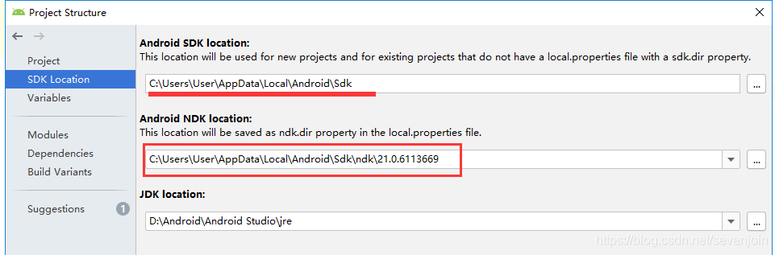

### 环境 
android studio
### 语言  
java c
### 准备  
1.创建带有登录功能的demo app   
run测试  
2.在当前app中创建Module(android library)   
3.调试  
当前app可以在build.gradle中直接添加依赖,dependencies中添加：  
```
implementation project(path: ':xxx')
```
### 打包
需要打包选中module，build->make modules 'xxx', build下的output就会有aar，但是默认只有debug的aar文件。    
debug和release切换可以由Build Variantis切换，这个和build.gradle中的buildTypes是关联的，相当于一个便捷操作。  
buildTypes中定义的release版本主要是开启了代码混淆。  

### 引用
1.将aar文件复制到libs文件夹中  
2.build.gradle配置
```
repositories {
    flatDir {
        dirs 'libs'
    }
}
dependencies {
    implementation (name:'xxx', ext:'aar')
}
```
但我的测试环境中gradle是7.x引用后报错：
```
Build was configured to prefer settings repositories over project repositories but repository 'flatDir' was added by build file 'app/build.gradle'
```
查询资料的意思说上面的引用方式过时了：
```
implementation(fileTree("libs"))
// 或者 implementation fileTree(dir: 'libs', include: ['*.aar'])
// 注意不能有implementation (name:'xxx', ext:'aar')，否则gradle sync没有问题，运行时候会报错Could not find :xxx:.
```

### 支持jni 
1.直接在AS中安装cmake和ndk(如果有LLDB选项也一起勾选)    
  
[可选] Project Structure->SDK location可以指定当前项目用那个ndk版本，指定后会在local.properties这个文件增加ndk.dir=xxx配置   
  
2.项目右键->add c++ to mudole

自动生成相关文件:

3.添加jni代码  
java文件：   
```
static {
       System.loadLibrary("xxx");
    }
    public native String cVersion();
    public String version(){
        return "test-1.0:"+cVersion();
    }
```
cpp文件：  
```
#include <jni.h>
extern "C"
JNIEXPORT jstring JNICALL
Java_com_abc_sc_Entrance_cVersion(JNIEnv *env, jobject instance) {
    return (*env).NewStringUTF("c2.0");
}
```
4.正常打包运行即可，c++代码也可以添加断点调试