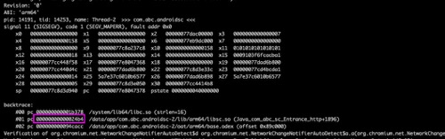
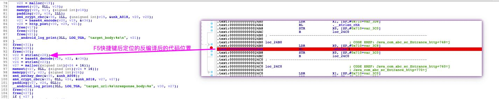

#### 1.adb logcat 可以查看到native层输出的崩溃日志  
找到崩溃栈函数的地址信息，圈出内容

#### 2.获取so文件
```
adb pull /data/app/com.abc.androidsc-2/lib/arm64/libsc.so ~/Downloads
```
#### 3.将so在idea中打开，使用快捷键g打开地址跳转功能，F5反编译代码后分析


#### 4.查看逻辑发现是上个方法的返回结果为null导致的问题