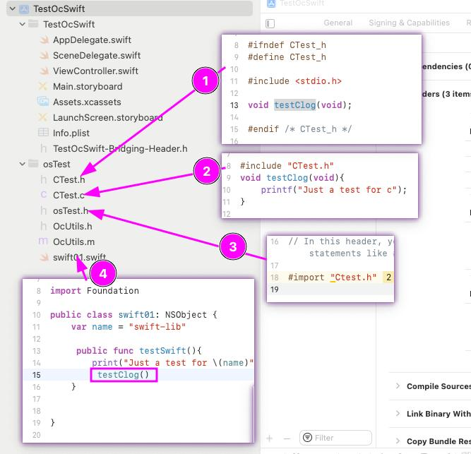
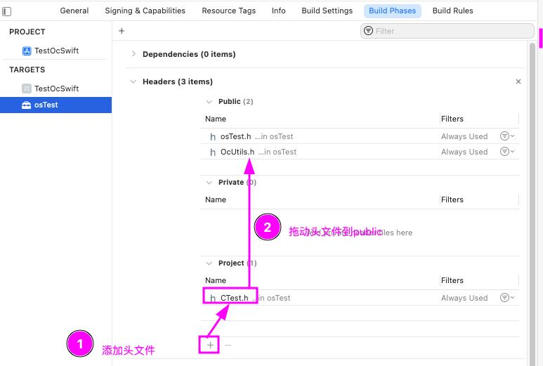

### Application项目
#### swift->oc(c)
swift调用oc需要通过桥接文件导入oc的头文件, 创建桥接文件有两种方式:

- 系统自动创建:  
在swift项目中创建oc类时会提示是否创建桥接文件, 选择创建, 就会自动创建一个名为:工程名-Bridging-Header.h的桥接文件  
- 手动创建:  
创建一个头文件:***.h, 然后在Build Settings中查找bridging, 将Objective-C Bridging Header设置为创建的头文件即可(注意文件路径)  

实现步骤：  
1.创建oc头文件（xcode自动创建-Bridging-Header.h桥接头文件）  
2.创建oc源文件  
3.将oc头文件import到-Bridging-Header.h桥接头文件  
4.swift直接调用即可  
[oc示例]   

[c示例]   

#### oc调用swift、c
oc调用swift依赖generated interface配置  
1.首先需要将swift需要被oc调用的属性与方法使用@objc标记  
2.导入通用的swift头文件, 即可调用全部swift的类, 这个swift头文件不需要自己创建, 默认为工程名-Swift.h   
[generated interface 配置]

[oc -> swift示例]   

[oc -> c示例]  
直接引用c的头文件即可  


### framework
在framework内不支持桥接头文件，所以需要用其他的方式  
#### swift->oc(c)
新建一个Framework工程中会包含一个.h文件，可以实现桥接头文件的作用  
[oc示例]
 
[c示例]


**注意**   
问题：framework的.h头文件中import可能会提示：Include of non-modular header inside framework module   
原因：需要将这个头文件加入到Build Phases 的Headers中


#### oc->swift、c
[swift]
暂未研究 
[c 和application工程一样]
```
// 引入头文件
#import "CTest.h"

@implementation Test
-(void)testLog{
   NSLog(@"Just a test for oc");
   // 调用头文件
   testClog();
}
@end
```


