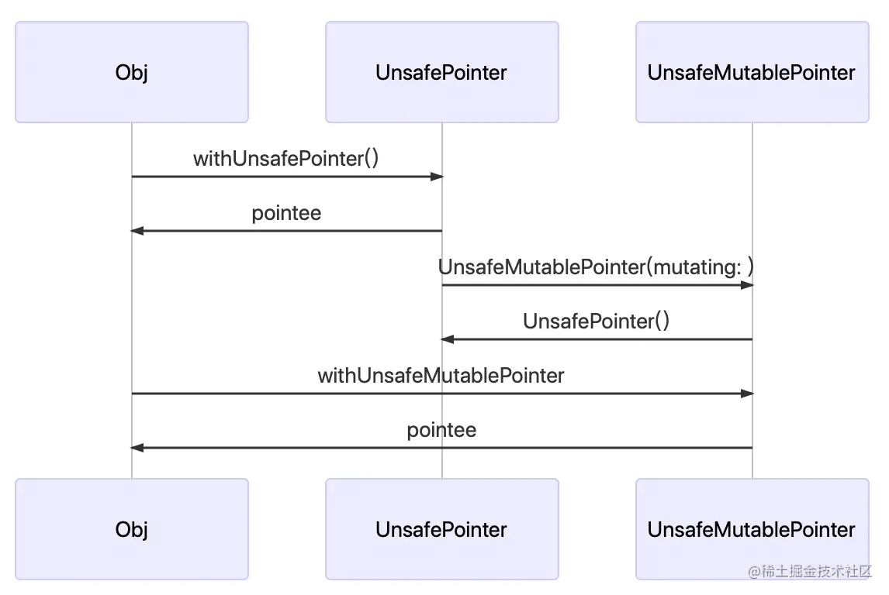
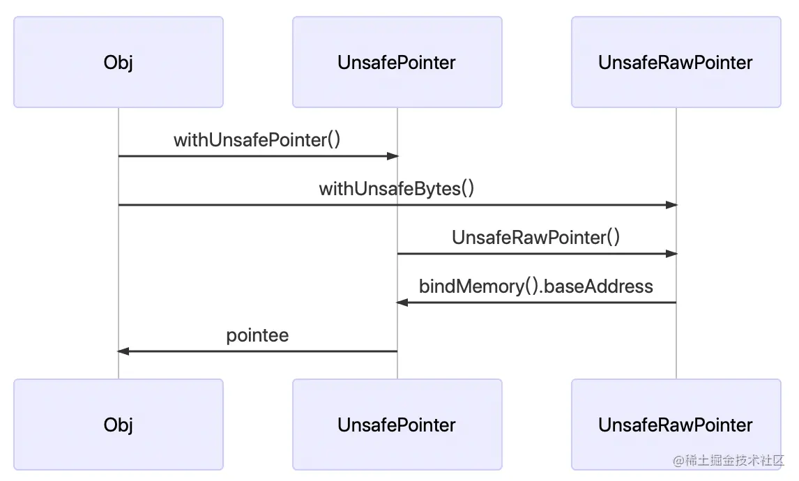

#### MemoryLayout查看内存大小
MemoryLayout是Swift为结构体struct等一些需要获取具体内存空间大小定义的枚举   
主要属性就是三个:  
```
/// 对应类型的实例在内存占用的真实字节大小
public static var size: Int { get }
/// 对应类型的实例在内存经过对齐后占用的字节大小
public static var stride: Int { get }
/// 默认内存对齐单位
public static var alignment: Int { get }
```
示例分析如下：  
```
struct Test {
    let res1: Bool = false
    let res2: Int = 0
    let res3: Bool = false
}

print("\(MemoryLayout<Test>.alignment)") // 8字节对齐
print("\(MemoryLayout<Test>.size)") //实际长度 Bool(1字节+7字节对齐)+Int(8字节)+Bool(1字节)
print("\(MemoryLayout<Test>.stride)") //对齐后长度Bool(1字节+7字节对齐)+Int(8字节)+Bool(1字节7字节对齐)

```

#### 常用的四种指针类型

|  swift   | oc  | 说明  |
|  ----  | ----  | ----  |
| UnsafePointer<T>  | const T * | 不可变类型指针 |
| UnsafeMutablePointer<T>  | T * | 可变类型指针 |
| UnsafeRawPointer | const void * | 不可变原生指针 |
| UnsafeMutableRawPointer  | void * | 可变原生指针 |

#### 类型指针

``` 
struct Obj {
    var name: Int = 5
}
var obj = Obj()
// 获取obj对象的指针
let pointer = withUnsafePointer(to: &obj, {$0})
// 打印指针对应的内容
print("\(pointer.pointee)")

-------------------------------

struct Obj {
    var name: Int = 5
    init(name: Int = 5) {
        self.name = name
    }
}
// 需要是var类型，后续才能更改内存内容
var obj = Obj()
// 获取可变类型指针
let pointer = withUnsafeMutablePointer(to: &obj, {$0})

// Obj: Obj(name: 5)
print("Obj: \(obj)")
// 修改内存内容
pointer.pointee = Obj(name: 10)
// Obj: Obj(name: 10)
print("\(pointer.pointee)")
// Obj: Obj(name: 10)
print("Obj: \(obj)")

```

#### 原生指针

```
var i = 2
// 获取原生指针
let pointerRaw = withUnsafeBytes(of: &i, {$0})
// 绑定数据类型
guard let pointer = pointerRaw.bindMemory(to: Int.self).baseAddress else { fatalError("类型绑定失败") }
// 获取指针内存内容
let j = pointer.pointee
// j:2 
print("j:\(j)")

```

#### 移动指针
- 类型指针提供了 pointee 属性，它可以以类型安全的方式读取和存储值。
- 当需要指针前进的时候，我们只需要指定想要前进的个数。类型指针会自动根据它所指向的数值类型来计算步进（stride）值。- (point+index).pointee 等同于 point.advanced(by: 1).pointee

示例代码：
```
// 将cchar* 类型转换为 String
private func CCharToString(ccharPoint:UnsafeMutablePointer<CChar>)->String{
    var string:String = ""
    var index:Int = 0
    while (ccharPoint+index).pointee != 0
    {
       string+=String(format: "%c", (ccharPoint+index).pointee)
       index += 1
    }
    ccharPoint.deallocate()
    return string
}
```

参考链接：https://juejin.cn/post/6844903751187169287  