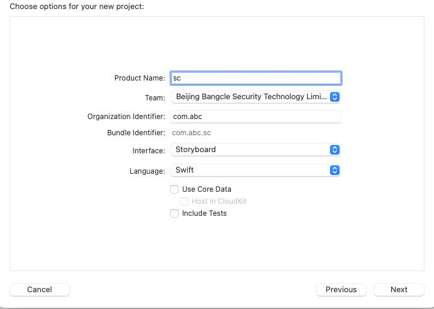
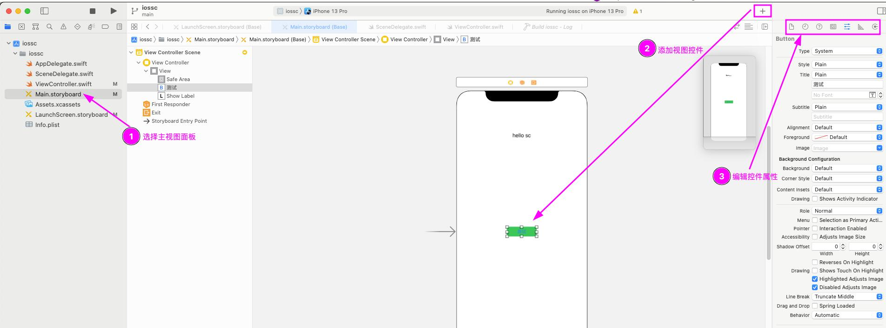
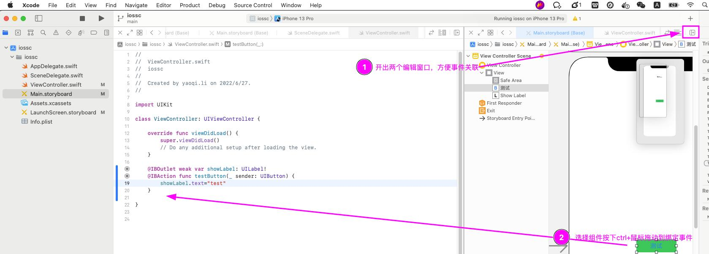
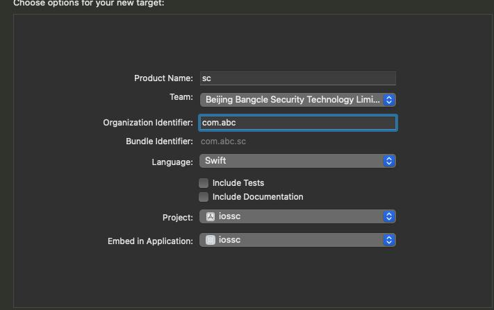
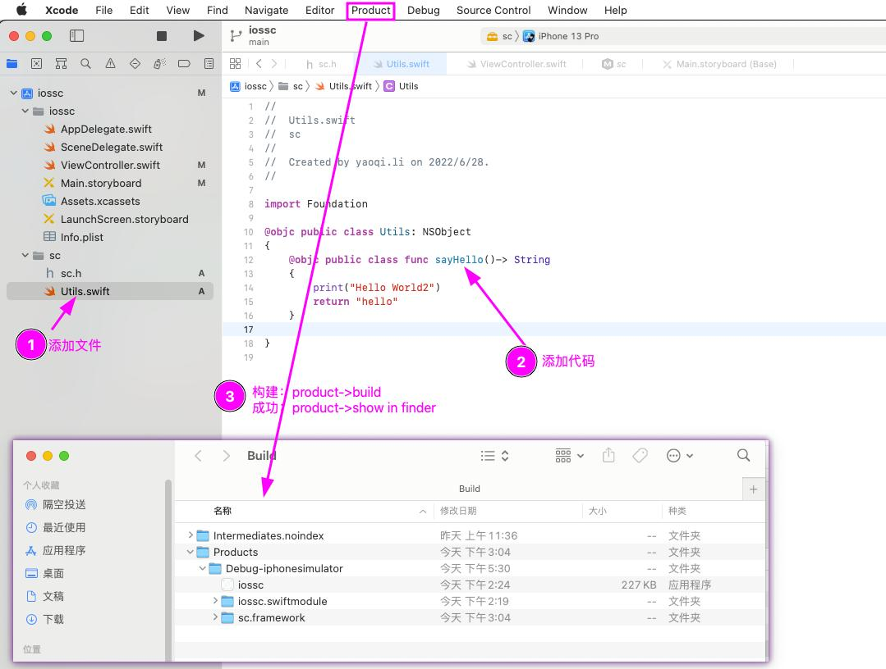
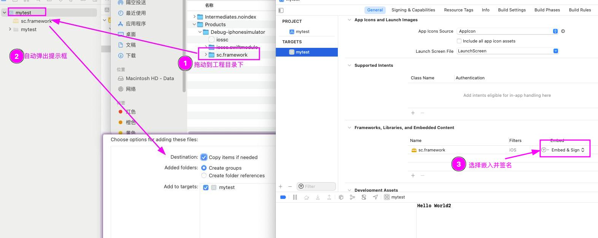

#### 创建app工程
new->project->app->填写工程信息->创建成功
- 工程信息可以勾选include tests会自动创建测试单元
- 开语言支持选择swift或者oc

添加试图控件

为控件绑定事件代码

点击run运行测试即可
#### 创建framework 
new->target->framework->填写工程信息->创建成功 
- 工程信息可以选择嵌入到当前工程（embed in application）
- 开语言支持选择swift或者oc  

添加方法代码,打包framework



#### 使用framework

代码调用：  
```
import UIKit
// 01:引入framework
import sc

class ViewController: UIViewController {

    @IBOutlet weak var testLabel: UILabel!
    override func viewDidLoad() {
        super.viewDidLoad()
        // 02:使用framework中的函数
        testLabel.text="test"+Utils.sayHello()
    }


}
```

run 运行即可

#### 常见问题
  **报错：**Cannot find type 'xxx' in scope  
  **原因：**可能是framework中定义的xxx类型不是public的    