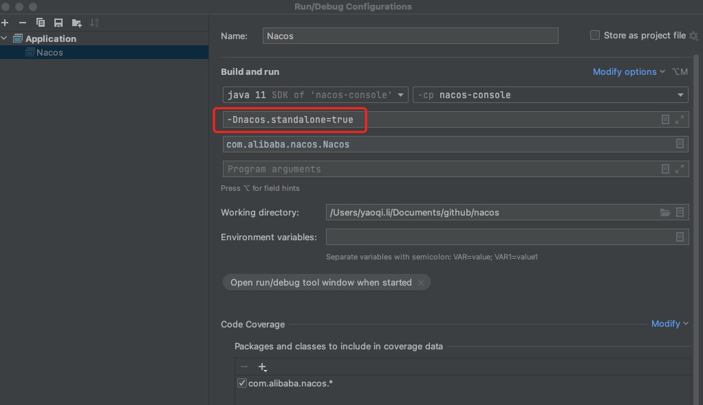

#### 本地编译调试
##### 项目说明
地址：https://github.com/alibaba/nacos  
项目结构：  
console： 依赖naming和config，服务的入口模块，程序主控制模块，实现控制台的功能、权限校验、服务状态、健康检查  
console-ui：主控程序的web前端样式模块  
naming： 核心1作为服务注册中心的实现模块,具备服务的注册和服务发现的功能   
config： 核心2服务配置的管理,提供api给客户端拉配置信息,以及提供更新配置,客户端通过长轮询的更新配置信息.数据存储生产是mysql  
address：提供查询nacos集群中节点个数以及IP列表的功能  
api: 客户端调用的api接口的抽象  
auth  
client： 主要是对依赖api模块和common模块,对api的接口的实现,给nacos的客户端使用.  
cmdb：主要是操作的数据的存储在内存中,该模块提供一个查询数据标签的接口.  
common： 主要是通用的工具包和字符串常量的定义  
consistency：服务一致性模块  
core：主要是实现Spring的PropertySource的后置处理器,用于加载nacos的default的配置信息.  
distribution：主要是打包nacos-server的操作,使用maven-assembly-plugin进行自定义打包,  
doc：看起来是存放文档的但是没什么东西  
example：提供了一个demo工程  
istio：istio架构下实现的服务调度控制  
plugin-default-impl：console引用这个插件，基于spi机制实现，目前只包含了plugin/auth的nacos-auth-plugin
plugin/auth：nacos-auth-plugin插件，支持用户、角色、权限的接口服务 
resources：就一个版权声明文件  
style：代码风格和规范的配置文件   
sys：系统工具，包含部分常量、文件监控和磁盘、网卡等管理工具类   
test：单元测试   

项目依赖图：  


##### 代码编译
参考工程中BUILDING，执行：  
```mvn -Prelease-nacos -Dmaven.test.skip=true clean install -U```
编译完成后程序包在distribution->target目录下。  
##### 本地调试

访问http://172.16.17.179:8848/nacos/index.html即可。  
