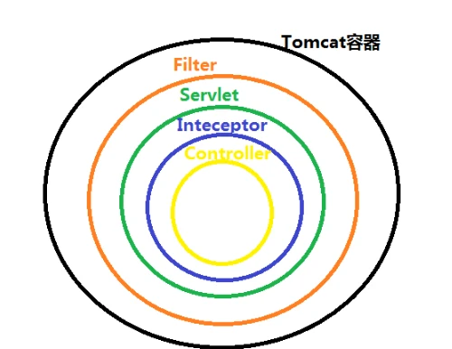
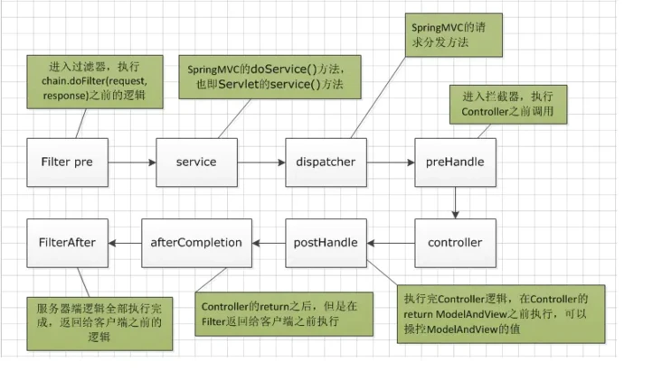
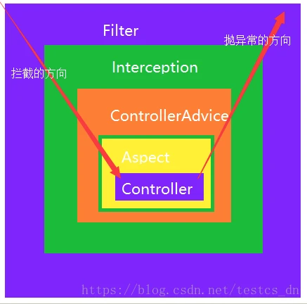
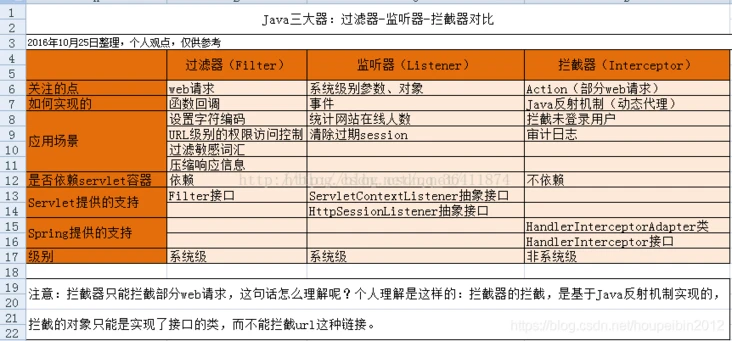

参考：https://segmentfault.com/a/1190000037755221   
说的很清晰为了防止丢失才copy一份，作者不要介意  
### 一、过滤器和拦截器的区别


1、过滤器和拦截器触发时机不一样，过滤器是在请求进入容器后，但请求进入servlet之前进行预处理的。请求结束返回也是，是在servlet处理完后，返回给前端之前。   
2、拦截器可以获取IOC容器中的各个bean，而过滤器就不行，因为拦截器是spring提供并管理的，spring的功能可以被拦截器使用，在拦截器里注入一个service，可以调用业务逻辑。而过滤器是JavaEE标准，只需依赖servlet api ，不需要依赖spring。  
3、过滤器的实现基于回调函数。而拦截器（代理模式）的实现基于反射 
4、Filter是依赖于Servlet容器，属于Servlet规范的一部分，而拦截器则是独立存在的，可以在任何情况下使用。  
5、Filter的执行由Servlet容器回调完成，而拦截器通常通过动态代理（反射）的方式来执行。  
6、Filter的生命周期由Servlet容器管理，而拦截器则可以通过IoC容器来管理，因此可以通过注入等方式来获取其他Bean的实例，因此使用会更方便。  
```
本质区别是过滤器是在servlet层面，拦截器在springBoot层面
1.过滤器可以修改request，而拦截器不能
2.过滤器需要在servlet容器中实现，拦截器可以适用于javaEE，javaSE等各种环境
3.拦截器可以调用IOC容器中的各种依赖，而过滤器不能
4.过滤器只能在请求的前后使用，而拦截器可以详细到每个方法**
```

```
过滤器（Filter） ：可以拿到原始的http请求，但是拿不到你请求的控制器和请求控制器中的方法的信息。  
拦截器（Interceptor）：可以拿到你请求的控制器和方法，却拿不到请求方法的参数。  
切片（Aspect）: 可以拿到方法的参数，但是却拿不到http请求和响应的对象 
```


### 二、过滤器
两种实现方式：   
1、使用spring boot提供的FilterRegistrationBean注册Filter  
2、使用原生servlet注解定义Filter   
两种方式的本质都是一样的，都是去FilterRegistrationBean注册自定义Filter，**但是我在使用过程中尝试在自定义的starter中实现接口的过滤，方式1不生效，方式2可以生效**  

#### 方式一: （使用spring boot提供的FilterRegistrationBean注册Filter ）  
①、先定义Filter：
```
package com.corwien.filter;
import javax.servlet.*;
import java.io.IOException;
public class MyFilter implements Filter {
    @Override public void init(FilterConfig filterConfig) throws ServletException {

    }
    @Override public void doFilter(ServletRequest servletRequest, ServletResponse servletResponse, FilterChain filterChain) throws IOException, ServletException { // do something 处理request 或response
     // doFilter()方法中的servletRequest参数的类型是ServletRequest，需要转换为HttpServletRequest类型方便调用某些方法
      System.out.println("filter1"); // 调用filter链中的下一个filter

   HttpServletRequest request = (HttpServletRequest) servletRequest;
        HttpServletResponse response = (HttpServletResponse) servletResponse;
 
        String ip = request.getRemoteAddr();
        String url = request.getRequestURL().toString();
        SimpleDateFormat sdf = new SimpleDateFormat("yyyy-MM-dd HH:mm:ss");
        Date d = new Date();
        String date = sdf.format(d);
 
        System.out.printf("%s %s 访问了 %s%n", date, ip, url);
        
        filterChain.doFilter(request, response);
    }
    @Override public void destroy() {

    }
}
```
②、注册自定义Filter
```
@Configuration
public class FilterConfig {

    @Bean
    public FilterRegistrationBean registrationBean() {
       ** FilterRegistrationBean filterRegistrationBean = new FilterRegistrationBean(new** **MyFilter());**
        filterRegistrationBean.addUrlPatterns("/*");
        return filterRegistrationBean;
    }
}
```
方式一的①②步骤可以用下面这段代码代替：
```
@Configuration public class FilterConfig {
 
    @Bean public **FilterRegistrationBean** registFilter() {
        **FilterRegistrationBean registration** **= new FilterRegistrationBean();
        registration.setFilter(new** **LogCostFilter());**
        registration.addUrlPatterns("/*");
        registration.setName("LogCostFilter");
        registration.setOrder(1); return registration;
    }
 
}
public class LogCostFilter implements Filter {
    @Override public void init(FilterConfig filterConfig) throws ServletException {
 
    }
 
    @Override public void doFilter(ServletRequest servletRequest, ServletResponse servletResponse, FilterChain filterChain) throws IOException, ServletException { long start = System.currentTimeMillis();
        filterChain.doFilter(servletRequest,servletResponse);
        System.out.println("Execute cost="+(System.currentTimeMillis()-start));
    }
 
    @Override public void destroy() {
 
    }
```
#### 方式二：（使用原生servlet注解定义Filter ）

```
// 注入spring容器
@Component // 定义filterName 和过滤的url
@WebFilter(filterName = "my2Filter" ,urlPatterns = "/*") public class My2Filter implements Filter {
    @Override public void init(FilterConfig filterConfig) throws ServletException {

    }
    @Override public void doFilter(ServletRequest servletRequest, ServletResponse servletResponse, FilterChain filterChain) throws IOException, ServletException {
        System.out.println("filter2");
    }
    @Override public void destroy() {

    }
}
```
这里直接用@WebFilter就可以进行配置，同样，可以设置url匹配模式，过滤器名称等。这里需要注意一点的是@WebFilter这个注解是Servlet3.0的规范，并不是Spring boot提供的。除了这个注解以外，我们还需在启动类中加另外一个注解：@ServletComponetScan，指定扫描的包。   

### 三、拦截器的配置
实现拦截器可以通过继承 HandlerInterceptorAdapter类也可以通过实现HandlerInterceptor这个接口。另外，如果preHandle方法return true，则继续后续处理。   

首先我们实现拦截器类：   
```
public class LogCostInterceptor implements HandlerInterceptor { long start = System.currentTimeMillis();
    @Override public boolean preHandle(HttpServletRequest httpServletRequest, HttpServletResponse httpServletResponse, Object o) throws Exception {
        start = System.currentTimeMillis(); return true;
    }
 
    @Override public void postHandle(HttpServletRequest httpServletRequest, HttpServletResponse httpServletResponse, Object o, ModelAndView modelAndView) throws Exception {
        System.out.println("Interceptor cost="+(System.currentTimeMillis()-start));
    }
 
    @Override public void afterCompletion(HttpServletRequest httpServletRequest, HttpServletResponse httpServletResponse, Object o, Exception e) throws Exception {
    }
}
```
我们还需要实现HandlerInterceptor这个接口，这个接口包括三个方法，preHandle是请求执行前执行的，postHandler是请求结束执行的，但只有preHandle方法返回true的时候才会执行，afterCompletion是视图渲染完成后才执行，同样需要preHandle返回true，该方法通常用于清理资源等工作。  
除了实现上面的接口外，我们还需对其进行配置：  
```
@Configuration public class InterceptorConfig extends WebMvcConfigurerAdapter {
 
    @Override public void addInterceptors(InterceptorRegistry registry) {
        registry.addInterceptor(new LogCostInterceptor()).addPathPatterns("/**"); super.addInterceptors(registry);
    }
}
```
这里我们继承了WebMVCConfigurerAdapter，这里我们重写了addInterceptors这个方法，进行拦截器的配置，主要配置项就两个，一个是指定拦截器，第二个是指定拦截的URL。   
```
拦截器不生效常见问题：
1）是否有加@Configuration
2）拦截路径是否有问题 ** 和 *
3）拦截器最后路径一定要 “/**”， 如果是目录的话则是 /*/
```
```
总结一下:创建拦截器需要两步：
1、自定义拦截器
2、注册拦截器
```
### 四、应用场景
拦截器是在DispatcherServlet这个servlet中执行的，因此所有的请求最先进入Filter，最后离开Filter。其顺序如下。   
Filter->Interceptor.preHandle->Handler->Interceptor.postHandle->Interceptor.afterCompletion->Filter 
拦截器应用场景   
拦截器本质上是面向切面编程（AOP），符合横切关注点的功能都可以放在拦截器中来实现，主要的应用场景包括：
```   
1）登录验证，判断用户是否登录。
2）权限验证，判断用户是否有权限访问资源，如校验token
3）日志记录，记录请求操作日志（用户ip，访问时间等），以便统计请求访问量。
4）处理cookie、本地化、国际化、主题等。
5）性能监控，监控请求处理时长等。
6）通用行为：读取cookie得到用户信息并将用户对象放入请求，从而方便后续流程使用，还有如提取Locale、Theme信息等，只要是多个处理器都需要的即可使用拦截器实现）
```
过滤器应用场景:
```
1）过滤敏感词汇（防止sql注入）
2）设置字符编码
3）URL级别的权限访问控制
4）压缩响应信息
```



