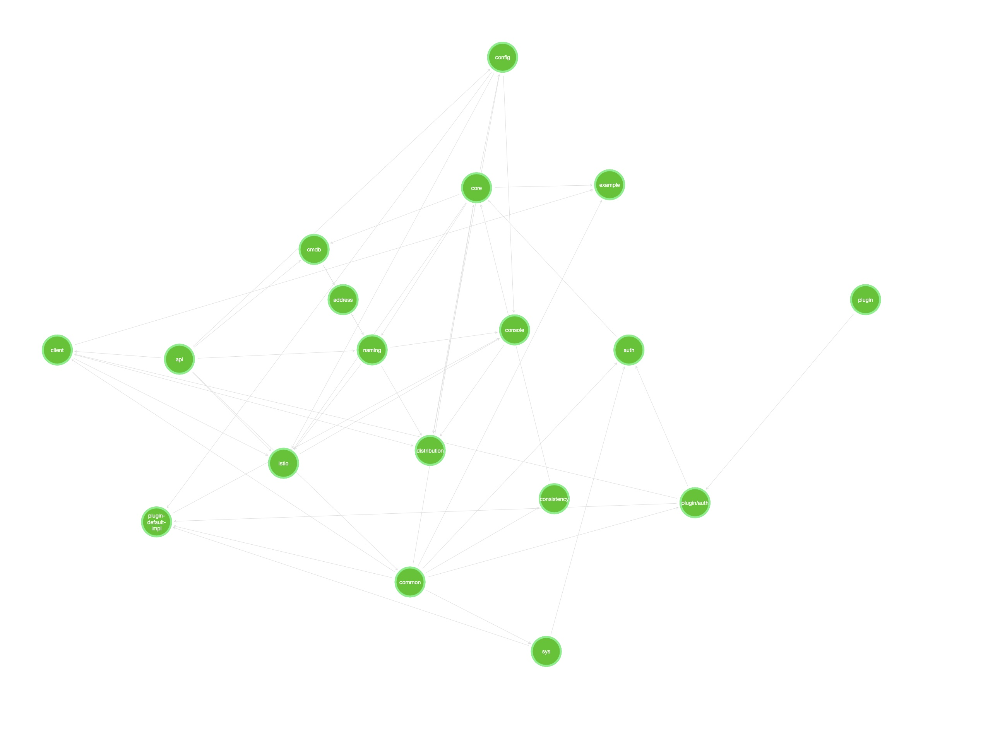

#### 依赖（mac）  
```brew install xmlstarlet```
#### 执行  
bash run.sh 工程路径  
示例：  
```bash run.sh ~/Documents/github/nacos ```

#### 数据可视化  
将执行的json结果放到地址中即可：http://relation-graph.com/#/options-tool  

#### 效果图
