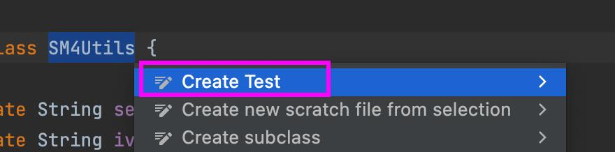

### 1.maven 引入依赖 
```
<dependency>
            <groupId>org.junit.jupiter</groupId>
            <artifactId>junit-jupiter</artifactId>
            <version>5.8.2</version>
            <scope>test</scope>
        </dependency>
```
### 2.MAC版本选中类后快捷键option+enter创建单元测试类

### 3.编写测试用例即可（Junit5）
