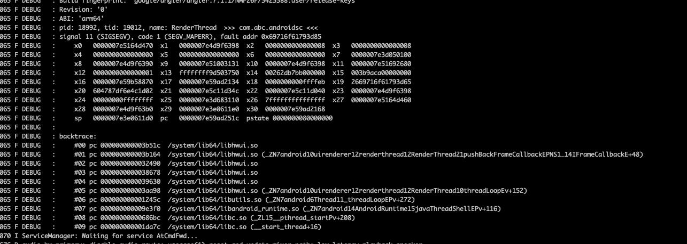

尝试在android中写一个jni的方法，运行之后经常崩溃，且崩溃的信息类似如下，看不到自己写的so的调用栈：  

后来经过分析发现是因为我把同一个动态内存free了两次导致   
#### 关于free查阅资料后总结如下：  
操作系统在调用malloc函数时，会默认在malloc分配的物理内存前面分配一个数据结构，这个数据结构记录了这次分配内存的大小，在用户眼中这个操作是透明的。  
那么当用户需要free时，free函数会把指针退回到这个结构体中，找到该内存的大小，这样就可以正确的释放内存了  
1）free只是释放了malloc所申请的内存，并没有改变指针的值；  
2）由于指针所指向的内存空间已经被释放，所以其他代码有机会改写其中的内容，相当于该指针从此指向了自己无法控制的区域（无法控制这么说还是可以去使用的，只是危险），也成为野指针（野指针指指向一个已删除的对象或未申请访问受限内存区域的指针。与空指针不同，野指针无法通过简单地判断是否为NULL避免）   
3）为了避免错误，所以最好在free之后，使指针指向NULL   

根据原理的解释分析：free函数的作用只是告诉操作系统该内存不用了，可以收回，操作系统就把该内存链接到链接表上，但是这段内存用户还是可以访问到的，只是该内存的值可能已经发生了变化    