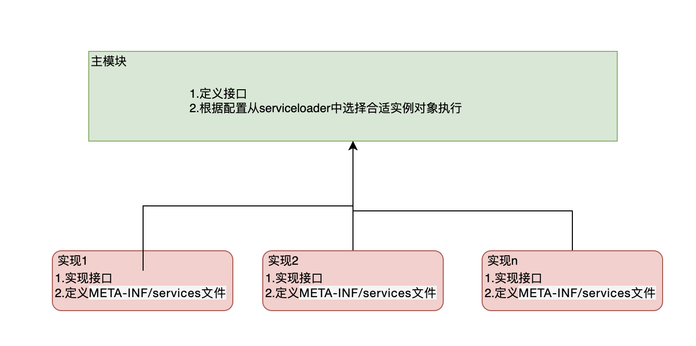

#### Service Provider Interface  
```Java提供的一套用来被第三方实现或者扩展的API，它可以用来启用框架扩展和替换组件```
#### SPI的demo
service接口定义：  
```package com.qihaha.service;
public interface service {

    String doSomething();
}
```
service接口实现：  
```
package com.qihaha.service;

public class service1 implements service{

    @Override
    public String doSomething() {
        return "service1";
    }
}
```    
```
package com.qihaha.service;

public class service2 implements service{

    @Override
    public String doSomething() {
        return "service2";
    }
}

```   
main函数调用：  
```
package com.qihaha.main;

import com.qihaha.service.service;
import java.util.ServiceLoader;

public class Application {

    public static void main(String[] args) {
        ServiceLoader<service> load = ServiceLoader.load(service.class);
        for (service ser : load) {
            System.out.println(ser.doSomething());
        }
    }
}
```
resources/META-INF/services/com.qihaha.service.service文件： 
```
com.qihaha.service.service1
com.qihaha.service.service2
``` 
执行结果：  
```
service1
service2
```
#### SPI关键技术点
```
// new ServiceLoader时初始化一个LinkedHashMap存放实例化对象，线程不安全
private LinkedHashMap<String,S> providers = new LinkedHashMap<>();  

private ServiceLoader(Class<S> svc, ClassLoader cl) {
        // 为空判断
        service = Objects.requireNonNull(svc, "Service interface cannot be null");
        // cl为空时通过ClassLoader.getSystemClassLoader()获取classloader，获取的结果其实是同一个对象
        loader = (cl == null) ? ClassLoader.getSystemClassLoader() : cl;
        acc = (System.getSecurityManager() != null) ? AccessController.getContext() : null;
        reload();
    }

public void reload() {
        providers.clear();
        // 实现了懒加载的迭代器，多个实例的时候迭代器获取需要全部实例化
        lookupIterator = new LazyIterator(service, loader);
    }

    private S nextService() {
            if (!hasNextService())
                throw new NoSuchElementException();
            String cn = nextName;
            nextName = null;
            Class<?> c = null;
            try {
                // 当前类实现了Iterable接口，重写的next方法中会调用到这里，实现反射加载
                c = Class.forName(cn, false, loader);
            } catch (ClassNotFoundException x) {
                fail(service,
                     "Provider " + cn + " not found");
            }
            if (!service.isAssignableFrom(c)) {
                fail(service,
                     "Provider " + cn  + " not a subtype");
            }
            try {
                // 加入缓存中
                S p = service.cast(c.newInstance());
                providers.put(cn, p);
                return p;
            } catch (Throwable x) {
                fail(service,
                     "Provider " + cn + " could not be instantiated",
                     x);
            }
            throw new Error();          // This cannot happen
        }
```
#### SPI场景分析

##### jdbc数据库驱动
```
    //定义MySQL的数据库驱动程序，jdbc4.0之后不需要装载驱动，依靠SPI机制自动加载了（META-INF/services目录，里面有一个java.sql.Driver的文件）
    public static String DBDRIVER="com.mysql.jdbc.Driver";
    public static String DBURL="jdbc:mysql://localhost:23306/dataease";
    public static String DBUSER="root";
    public static String DBPASS="root";

    public static void main(String[] args)throws Exception {
        // 可以切换数据库为pg，jdk的drivermanager类会依靠SPI加载所有的驱动（只要maven引用，classpath能找到的）getConnection方法根据URL的特征判断知道当前需要的驱动是哪个。
        DBURL = "jdbc:postgresql://localhost:5432/test";
        DBUSER = "postgres";
        DBPASS = "postgres";

        Connection conn = null; //数据库连接
        Statement stmt = null; //数据库操作
        String sql = "select * from book;";

        // Class.forName(DBDRIVER); 这个注册驱动的方法可以不用调用了
        conn = DriverManager.getConnection(DBURL, DBUSER, DBPASS);
        stmt = conn.createStatement(); //实例化Statement对象
        ResultSet rs=null;
        rs = stmt.executeQuery(sql);
        while(rs.next()){
            int id = rs.getInt("id");
            System.out.println(id);
        }
        stmt.close(); 
        conn.close();
    }
```
```
// getConnection的核心代码


```

##### spring boot中的starter
自己实现一个starter  
pom:  
```
<dependencies>
        <dependency>
            <groupId>org.springframework.boot</groupId>
            <artifactId>spring-boot-starter</artifactId>
            <version>2.6.3</version>
        </dependency>
        <dependency>
            <groupId>org.projectlombok</groupId>
            <artifactId>lombok</artifactId>
            <version>1.18.22</version>
        </dependency>
    </dependencies>
```
代码：  
```
package com.qihaha.model;

import lombok.Data;
import org.springframework.boot.context.properties.ConfigurationProperties;

@ConfigurationProperties(prefix = "model")
@Data
public class ModelProperties {

    private ModelTag up = new ModelTag();
    private ModelTag down = new ModelTag();

    @Data
    public static class ModelTag{
        private String id;
        private String tag;
    }
}

package com.qihaha.model;

import org.springframework.boot.context.properties.EnableConfigurationProperties;
import org.springframework.context.annotation.Bean;
import org.springframework.context.annotation.Configuration;

@EnableConfigurationProperties(value = ModelProperties.class)
@Configuration
public class ModelAutoConfiguration {

    @Bean
    public ModelTag modelTag(ModelProperties modelProperties){
        return new ModelTag(modelProperties.getUp().getId(),modelProperties.getDown().getTag());
    }

}

package com.qihaha.model;

public class ModelTag {
    private String str = "";

    public ModelTag(String id,String tag) {
        str=id+":"+tag;
    }

    public String getIdTag(){
        return str;
    }
}


```

resources/META-INF/spring.factories:   
```
#Auto Configure
org.springframework.boot.autoconfigure.EnableAutoConfiguration=\
com.qihaha.model.ModelAutoConfiguration
```
mvn install 之后就可以被其他工程引用  
配置application.yml:   
```
model:
  up:
    id: 111
    tag: 222
  down:
    id: 333
    tag: 444
```
代码注入调用： 
```
  @Autowired
  private ModelTag modelTag;
  
  @RequestMapping(value = {"/getid", "/1"}, method = RequestMethod.POST)
  public String information(@RequestBody String strBody) {
    return modelTag.getIdTag();
  }
``` 


