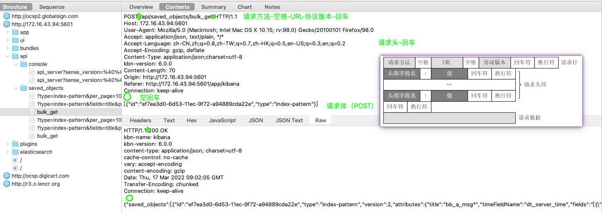
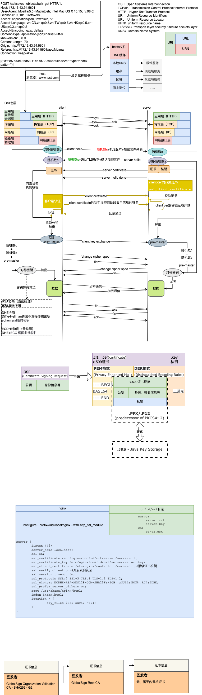

#### 名词
```
OSI：Open Systems Interconnection
TCP/IP：Transmission Control Protocol/Internet Protocol
HTTP：Hyper Text Transfer Protocol
URI：Uniform Resource Identifiers
URL：Uniform Resource Locator
URN：uniform resource name
```
#### 返回码
```
1xx：指示信息--表示请求已接收，继续处理
2xx：成功--表示请求已被成功接收、理解、接受
3xx：重定向--要完成请求必须进行更进一步的操作
4xx：客户端错误--请求有语法错误或请求无法实现
5xx：服务器端错误--服务器未能实现合法的请求
```
#### 请求方法
```
GET  请求指定的页面信息，并返回实体主体。
HEAD     类似于get请求，只不过返回的响应中没有具体的内容，用于获取报头
POST     向指定资源提交数据进行处理请求（例如提交表单或者上传文件）。数据被包含在请求体中。POST请求可能会导致新的资源的建立和/或已有资源的修改。
PUT  从客户端向服务器传送的数据取代指定的文档的内容。
DELETE   请求服务器删除指定的页面。
CONNECT  HTTP/1.1协议中预留给能够将连接改为管道方式的代理服务器。
OPTIONS  允许客户端查看服务器的性能。
TRACE    回显服务器收到的请求，主要用于测试或诊断。
```

#### http协议说明


#### https通信过程及基础概念

