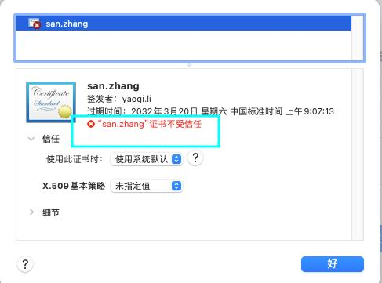
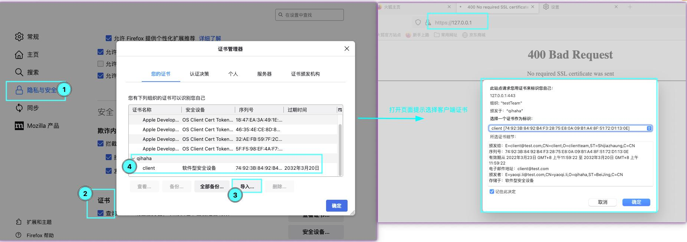

#### 1.检查是否支持https（with-http_ssl_module） 
```
nginx -V | grep --with-http_ssl_module
```
#### 2.生成必要的各种证书
```
cd /etc/nginx/conf.d/
mkdir crt
cd crt/

# 生成模拟ca的私钥和证书
mkdir ca
cd ca/
openssl genrsa -out ca.key 4096
openssl req -new -x509 -days 3650 -key ca.key -out ca.crt
# 生成服务端证书
cd ..
mkdir server
cd server
openssl genrsa -out server.key 4096
openssl req -new -key server.key -out server.csr
openssl x509 -req -in server.csr -CA ../ca/ca.crt -CAkey ../ca/ca.key -CAcreateserial -out server.crt -days 3650
# 生成客户端证书（用于双向验证）
cd ..
mkdir client
cd client/
openssl genrsa -out client.key 4096
openssl req -new -key client.key -out client.csr
openssl x509 -req -in client.csr -CA ../ca/ca.crt -CAkey ../ca/ca.key -CAcreateserial -out client.crt -days 3650
```
#### 3.配置nginx（包含客户端证书验证）
```
cat https.conf
server {
        listen 443;
        server_name localhost;
        ssl on;
        ssl_certificate /etc/nginx/conf.d/crt/server/server.crt;
        ssl_certificate_key /etc/nginx/conf.d/crt/server/server.key;
        ssl_client_certificate /etc/nginx/conf.d/crt/ca/ca.crt;#根级证书公钥，用于验证各个二级client，满足客户端n个证书服务端之配置一个场景
        ssl_verify_client on;#开启双向认证
        ssl_session_timeout 5m;
        ssl_protocols SSLv2 SSLv3 TLSv1 TLSv1.1 TLSv1.2;
        ssl_ciphers ECDHE-RSA-AES128-GCM-SHA256:HIGH:!aNULL:!MD5:!RC4:!DHE;
        ssl_prefer_server_ciphers on;
        root /usr/share/nginx/html;
        index index.html;
        location / {
                try_files $uri $uri/ =404;
        }
}

```
*注意chrome浏览器可能不允许访问提示如下* 
```
127.0.0.1 通常会使用加密技术来保护您的信息。Chrome 此次尝试连接到 127.0.0.1 时，该网站发回了异常的错误凭据。这可能是因为有攻击者在试图冒充 127.0.0.1，或者 Wi-Fi 登录屏幕中断了此次连接。请放心，您的信息仍然是安全的，因为 Chrome 尚未进行任何数据交换便停止了连接。
您目前无法访问127.0.0.1，因为此网站发送了Chrome无法处理的杂乱凭据。网络错误和攻击通常是暂时的，因此，此网页稍后可能会恢复正常。

解决方案：
是在当前页面用键盘输入  thisisunsafe  ，不是在地址栏输入，就直接敲键盘就行了，页面即会自动刷新进入网页。如果没效果可以多试几次，可能是输错了。

原因：
因为Chrome不信任这些自签名ssl证书，为了安全起见，直接禁止访问了，thisisunsafe 这个命令，说明你已经了解并确认这是个不安全的网站，你仍要访问就给你访问了。

```
*浏览器访问地址栏会提示不安全，因为证书是不被信任的：*  



#### 4.客户端认证访问（curl）
开启客户端认证后访问会提示：
```
curl -k https://127.0.0.1
400 Bad Request
No required SSL certificate was sent
nginx/1.21.6
```
```
curl -v -s -k --cert crt/client/client.crt --key crt/client/client.key https://127.0.0.1 
或者
curl -k --cacert crt/ca/ca.crt --cert crt/client/client.crt --key crt/client/client.key --tlsv1.2 https://127.0.0.1
<!DOCTYPE html>
<html>
......
<h1>Welcome to nginx!</h1>
......
</html>
```
#### 5.客户端认证访问（firefox）
电脑浏览器打开的话需要提前安装PKCS12证书，PKCS12包含证书和私钥:
```
openssl pkcs12 -export -in client.crt -inkey client.key -passin pass:111111 -password pass:111111 -out client.p12
或者加上根证书导出
openssl pkcs12 -export -in client.crt -inkey client.key -chain -CAfile ../ca/ca.crt -passin pass:111111 -password pass:111111 -out client-all.p12
```
firefox中配置方法如下：  
可能会存在配置后没生效的情况，稍等一会再试就好了，猜测是因为http开启keepalive保持存活后tcp连接复用导致证书还没更新  


